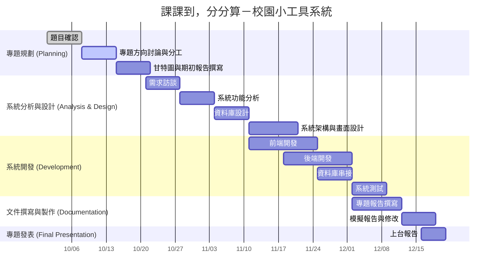
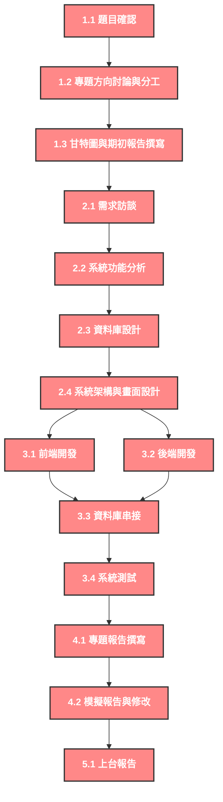

# 第十組- ```課課到，分分算```
我們的專題想呈現一個 校園小工具系統。

這個系統主要有兩個功能：
* 可以輸入課表，系統就會自動生成每週的課程提醒，幫助同學不會忘記上課。
* 可以輸入各科成績，系統會自動計算平均分數，讓同學隨時掌握學習狀況。
整體目標是讓同學更方便管理時間與成績，提高學習效率。
## 組員名單
組長
* **黃奕菱 C112118209**
  
組員
* 邱洪恩 C112118248
* 張天俞 C112118232
* 曾靜慧 C112118251
##  一、專題時程規劃與分工

### 1️⃣ 專題規劃

| 編號 | 工作項目 | 工作內容 | 預估時間 | 
|------|-----------|-----------|------------|
| 1.1 | 題目確認 | 決定專題名稱與主要功能（課表提醒＋成績計算） | 第1週 | 
| 1.2 | 專題方向討論與分工 | 確定系統範圍、使用工具（HTML / JS / SQL 等）與成員分工 | 第1週 | 
| 1.3 | 甘特圖與期初報告撰寫 | 撰寫動機、目的、系統架構草圖 | 第2週 | 

---

### 2️⃣ 系統分析與設計

| 編號 | 工作項目 | 工作內容 | 預估時間 | 
|------|-----------|-----------|------------|
| 2.1 | 需求訪談 | 訪談同學、了解他們對課表提醒與成績計算功能的需求 | 第3週 | 
| 2.2 | 系統功能分析 | 確認系統模組：課表管理、成績管理、登入與提醒功能 | 第4週 | 
| 2.3 | 資料庫設計 | 規劃資料表（student、course、grade、schedule） | 第5週 | 
| 2.4 | 系統架構與畫面設計 | 繪製功能流程圖、介面草圖（如課表輸入頁面） | 第5–6週 | 

---

### 3️⃣ 系統開發

| 編號 | 工作項目 | 工作內容 | 預估時間 | 
|------|-----------|-----------|------------|
| 3.1 | 前端開發 | 製作輸入介面（課表輸入、成績輸入、提醒畫面） | 第6-8週 | 
| 3.2 | 後端開發 | 實作資料處理與自動提醒邏輯（JavaScript / Python / PHP） | 第7-9週 | 
| 3.3 | 資料庫串接 | 建立資料庫連線，實現成績平均與課程查詢 | 第8-9週 | 
| 3.4 | 系統測試 | 檢查功能是否正確、修正錯誤 | 第10週 | 

---

### 4️⃣ 文件撰寫與製作

| 編號 | 工作項目 | 工作內容 | 預估時間 | 
|------|-----------|-----------|------------|
| 4.1 | 專題報告撰寫 | 撰寫完整期末報告（包含系統架構、流程圖、介面介紹） | 第10-11週 | 
| 4.2 | 模擬報告與修改 | 修正內容 | 第11週 | 

---

### 5️⃣ 專題發表

| 編號 | 工作項目 | 工作內容 | 預估時間 | 
|------|-----------|-----------|------------|
| 5.1 | 上台報告 | 系統展示與 Q&A | 第12週 | 

## 組員任務分配
| 組員        | 任務                     |
|-------------|--------------------------|
| 黃奕菱       | 製作甘特圖、時程規劃、專題報告撰寫、系統功能分析 |
| 邱洪恩       | 後端開發、資料庫串接 |
| 張天俞       | 系統架構草圖、系統架構與畫面設計、需求訪談 |
| 曾靜慧       | 前端開發、系統測試 |

##  二、甘特圖


##  三、PERT / CPM 圖

