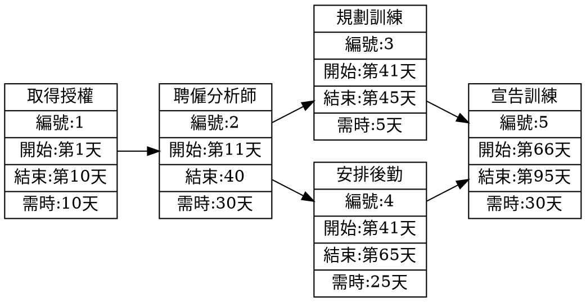

# 第十組- ```課課到，分分算```
我們的專題想呈現一個 校園小工具系統。

這個系統主要有兩個功能：
* 可以輸入課表，系統就會自動生成每週的課程提醒，幫助同學不會忘記上課。
* 可以輸入各科成績，系統會自動計算平均分數，讓同學隨時掌握學習狀況。
整體目標是讓同學更方便管理時間與成績，提高學習效率。
## 組員名單
組長
* **黃奕菱 C112118209**
  
組員
* 邱洪恩 C112118248
* 張天俞 C112118232
* 曾靜慧 C112118251
## 組員任務分配
| 組員        | 任務                     |
|-------------|--------------------------|
| 黃奕菱       | 撰寫後端 API（全部我先隨便放）             |
| 邱洪恩        | 製作甘特圖與時程規劃     |
| 張天俞        | PERT/CPM 圖與任務關聯分析 |
| 曾靜慧        | 撰寫前端畫面 |




