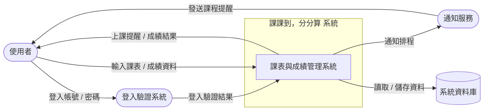
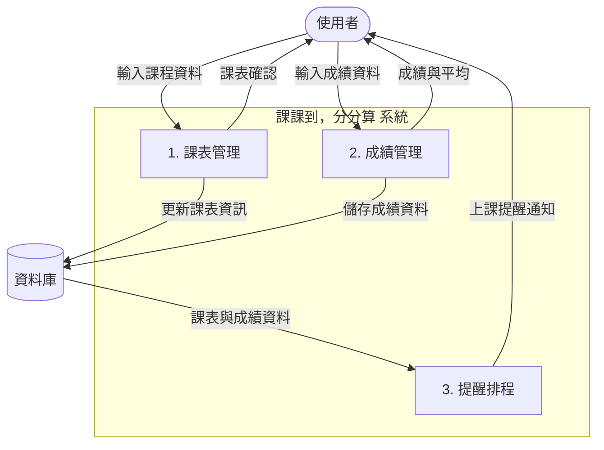

## 系統環境圖 (DFD)

## 系統環境圖說明

此圖為「課課到，分分算」系統的整體環境架構，主要顯示系統與外部實體之間的資料交換與互動流程：

| 元件 | 說明 |
|------|------|
| 使用者 (User) | 輸入課表與成績資料，接收提醒與查詢結果 |
| 登入驗證系統 (Auth) | 接收帳號密碼，驗證使用者身份 |
| 通知服務 (Notif) | 根據系統排程發送上課提醒 |
| 資料庫 (DB) | 儲存課程、成績與提醒設定資料 |
| 課課到系統 (System) | 系統核心，管理課表、成績與提醒功能 |

**整體流程概念：**  
使用者登入系統 → 系統驗證身份 → 輸入課表與成績 → 系統更新資料庫 → 系統排程生成提醒 → 通知服務發送上課提醒 → 使用者收到結果

---

## DFD 圖 0（資料流程圖第 0 層）

## DFD 圖 0 說明

| 號碼 | 程序名稱 | 功能說明 |
|------|-----------|-----------|
| 1 | 課表管理 | 新增、修改、刪除課程，並更新資料庫 |
| 2 | 成績管理 | 輸入成績、計算平均、更新資料庫 |
| 3 | 提醒排程 | 根據課表生成提醒並通知使用者 |

**整體流程概念：**  
使用者輸入課表與成績 → 系統更新資料庫 → 系統排程生成提醒 → 通知服務發送上課提醒 → 使用者收到結果
