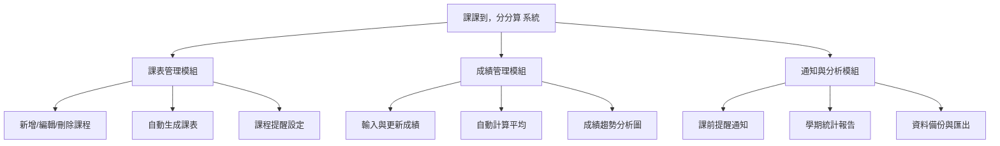

# 第十組- ```課課到，分分算```
## 功能性需求 (Functional Requirements)

1. **課表管理功能**  
   - 可新增、編輯、刪除課程資料（包含科目名稱、時間、地點、老師）。  

2. **自動課程提醒**  
   - 系統可根據課表發送上課提醒（可自訂提醒時間，例如課前10分鐘）。  

3. **成績紀錄與平均計算**  
   - 使用者輸入成績後，系統自動計算總平均與各科加權平均。  

4. **成績視覺化分析**  
   - 顯示長條圖或圓餅圖，幫助學生了解成績趨勢。  

---

## 非功能性需求 (Non-Functional Requirements)

1. **操作簡易性**  
   - 介面設計需直覺、易操作，適合一般學生使用。  

3. **可靠性**  
   - 系統須確保資料不會遺失，並具備自動備份機制。  

4. **相容性**  
   - 能在桌機、平板與手機等不同裝置上運行。  

5. **安全性 (Security)**  
   - 使用者個人資料需加密儲存，避免外洩。  

---

## 功能分解圖 



## 使用案例說明

---

### ⏰ 使用案例 1：管理課表

| 項目 | 說明 |
|------|------|
| **主要角色** | 使用者 |
| **前置條件** | 使用者已登入系統 |
| **主要流程** | 使用者可新增、編輯或刪除課程（含課名、時間、地點） |
| **替代流程** | 若課程時間重疊，系統提示錯誤 |
| **結果** | 課表更新並儲存在資料庫中 |

---

### ⏰ 使用案例 2：輸入與查詢成績

| 項目 | 說明 |
|------|------|
| **主要角色** | 使用者 |
| **前置條件** | 課程資料已存在 |
| **主要流程** | 使用者輸入各科成績，系統自動計算平均分數 |
| **替代流程** | 若輸入格式錯誤，系統提示重新輸入 |
| **結果** | 成績與平均分儲存並顯示於介面上 |

---

### ⏰ 使用案例 3：接收上課提醒

| 項目 | 說明 |
|------|------|
| **主要角色** | 使用者 |
| **前置條件** | 已設定課表與提醒時間 |
| **主要流程** | 系統於上課前發出通知（如10分鐘前） |
| **替代流程** | 若課程被修改，提醒時間自動更新 |
| **結果** | 使用者準時上課，避免遺漏課程 |

---

## 使用案例圖


