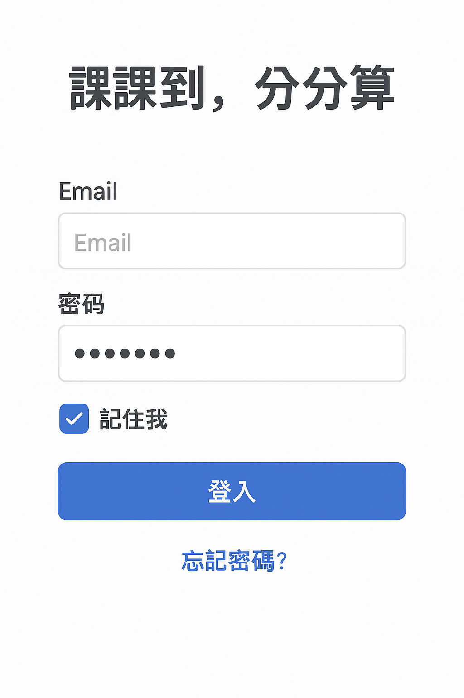
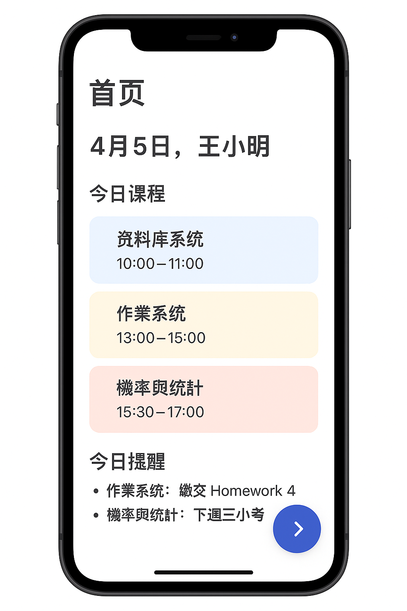
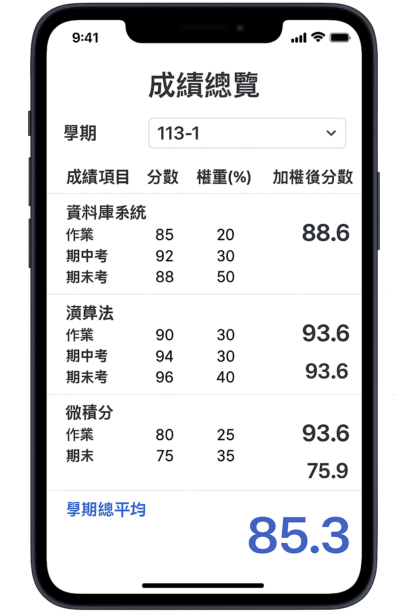
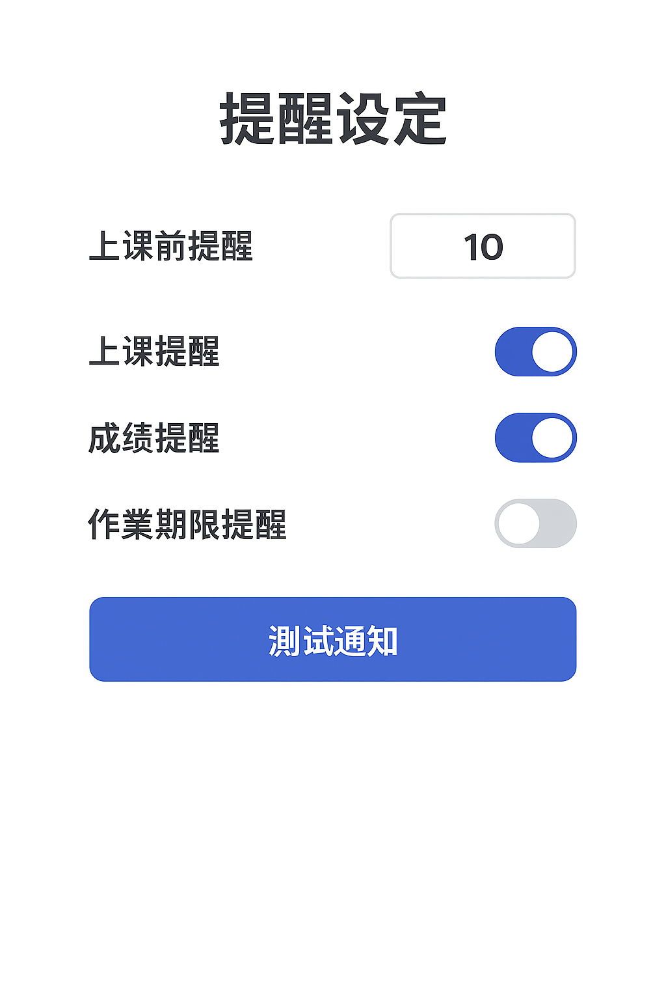
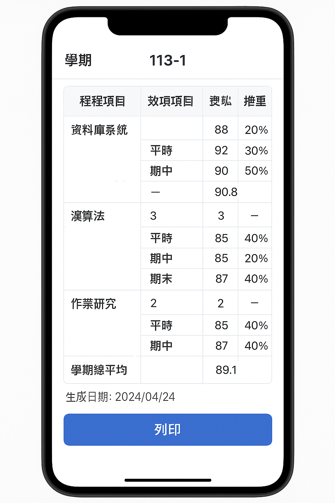

# hw6：課課到，分分算 – 五頁 Storyboard（含流程註釋）

---

# 📌 分鏡流程總覽（Flow Overview）

1. **登入畫面**  
   ↓ 使用者登入成功  
2. **今日概覽（首頁）**  
   ↓ 使用者選擇查看學期成績  
3. **成績總覽與平均計算**  
   ↓ 使用者選擇開啟提醒設定  
4. **提醒設定畫面**  
   ↓ 使用者選擇列印學期成績  
5. **成績報表列印預覽**

---

# 📘 螢幕一：登入畫面（Login）

### 📝 功能說明
- 提供 Email + 密碼登入  
- 可選擇「記住我」  
- 可導向忘記密碼（延伸功能）

### 🔁 **Next Step → 螢幕二：今日概覽**
登入成功後自動導向首頁。

---

# 📘 螢幕二：今日概覽

### 📝 功能說明
- 顯示今日課程、提醒、日期  
- 使用者可查看今天的所有行程  
- 可切換日期模式

### 🔁 **Next Step → 螢幕三：成績總覽與平均計算**
使用者點擊「成績」或「學期成績查詢」。

---

# 📘 螢幕三：成績總覽與平均計算

### 📝 功能說明
- 顯示學期內所有課程成績  
- 加權平均、總平均  
- 支援切換不同學期

### 🔁 **Next Step → 螢幕四：提醒設定畫面**
使用者想設定「即時成績提醒」。

---

# 📘 螢幕四：提醒設定畫面

### 📝 功能說明
- 設定上課前提醒  
- 成績更新提醒  
- 作業截止提醒  
- 系統通知偏好設定

### 🔁 **Next Step → 螢幕五：成績報表列印預覽**
使用者按下「列印學期成績」或報表相關按鈕。

---

# 📘 螢幕五：成績報表列印預覽

### 📝 功能說明
- 可預覽完整的學期成績報表  
- 格式為橫印 A4  
- 提供「列印」按鈕（PDF / Printer）

### 🏁 **流程至此結束**

---

